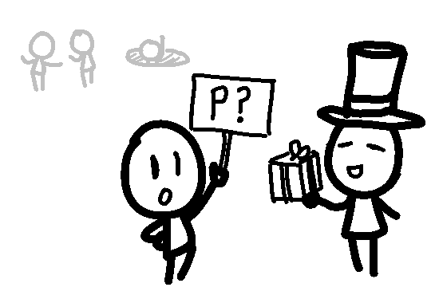

You raise a CFJ on if you're a PLAYER or not. An Agoran called TOP HAT MAN
soon arrives, and ASSIGNS the CFJ to emself. Meanwhile, you see a lot of
other Agorans in the distance notice your CfJ and start to DEBATE about
OBSCURE RULES. There's even an Agoran that seems to pop out of that pit
from before.

"Oh hey there new guy. Uh, yeah, it seems that it's not going to be so
clear-cut..." TOP HAT MAN tells you. "Although we could short-cut in a way
if you just register 'again', I suppose."

You have a new CFJ! It is "Am I a PLAYER?" It is still PENDING.

"Also, it's dangerous to go out alone, so take this." he then tells you. He
gives you a WELCOMING PACKAGE. It has 10 MONEYS and 1 GEM. Nice.

- 'Register' again to clear doubts about if you are registered at all or
not (although the exact time of registration is still ambiguous).
- Steal the TOP HAT from TOP HAT MAN
- Go DEBATE with the other Agorans
- (Write-in)

[nix chooses "~~carefully read~~ skim the rules for a sweet scam"](update2.md)
