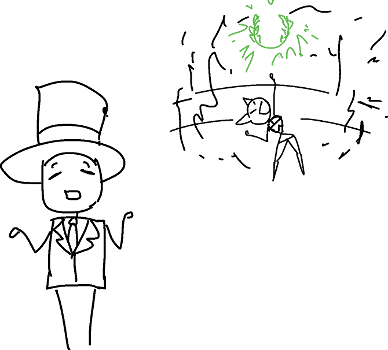
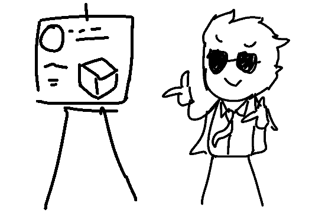
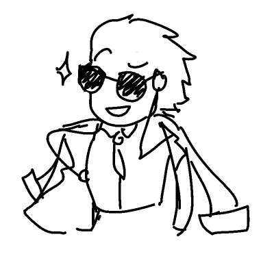
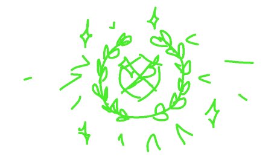

"So, what kind of scam has happened here?" you ask TOP HAT MAN.

"Oh. Yeah, pretty standard stuff. In AgoraBall, you could 'pass a ball to a player'. She passed everyone else's ball to herself - it's 'a ball', after all, and she's 'a player'. We shouldn't have missed that, but we did. She was pretty close to achieving a win, but thankfully we got to stop her before she did."

"My most gracious salutations to you mister ARBITOR, and in additament, this individual which is not one which my personage is familiarized with.  Beautiful greetings to you, I'm MAGNUS GLORIOUS. DISTRIBUTOR for the Agoran nomic, at your humblest service." an Agoran then mentions, butting in a bit in your conversation with TOP HAT MAN. He was wearing sunglasses and a fancy jacket over his shoulders.

"Oh, hello MAGNUS. What is it?"

"Well, as you may perceive sir, I would relish to put forwards for your consideration this PROTOSAL of my own. I'm sure that an esteemed individual such as yourself could provide feedback and insights of utmost value."

"Ah, hm. It's good." TOP HAT MAN mentioned, skimming through it, then finding more behind the schemata he was looking at. "Oh. There are more slides?"

"Fifteen, sir."

"Oh. Hm. We could perhaps, uhm. How do I say this. Trim it down, a bit? I think a couple of things here could be... rephrased. Shortened."

"On the contrary my finest sir, I believe it integrates a much needed solidity, robustness, fortitude to this here structural concern. This here is what we require to forfend ourselves from future and forthcoming shenanigans of the categorization of kind that have been recently performed by the miss LADY CATASTROVANIA."

"But to repair the scam that CAT did, we don't need all of this. If anything, it might add more scams." TOP HAT MAN advises.

"Indeed it might be so, but I raise you this: have you seen any scams in my this here protosal?"

"No, not really."

"See? Then there is no issue, sir."

TOP HAT MAN then sips air through his teeth. "Yeaaaaah, but..."

"Alright, alright. Hold open your ears for this, I've got a mental conception that might be of both of our satisfaction. I'll put both of these up and upon for distribution, and our most honorable Agorans can adjudicate via their own hearts and minds on this dilemma."

"Fine. I'm sure many Agorans want to get a WIN somehow already, so we might as well get this over with." TOP HAT MAN concludes

- Vote for TOP HAT MAN's Proposal to fix Agoraball. It's simpler, shorter, but it only covers Lady Cat's scam and what seem to be some other smaller polishes in other places, but it should keep Agoraball simple to understand and play for you.

- Vote for MAGNUS GLORIOUS' Proposal to fix Agoraball. It's heavily bureaucratic, redundant, and very technically-worded. It is likely more robust and safer from scams, but it's going to be more difficult for a player of your experience to reach a competitive level in comparison to other, more fluent and veteran Agorans.

- (Write in)
