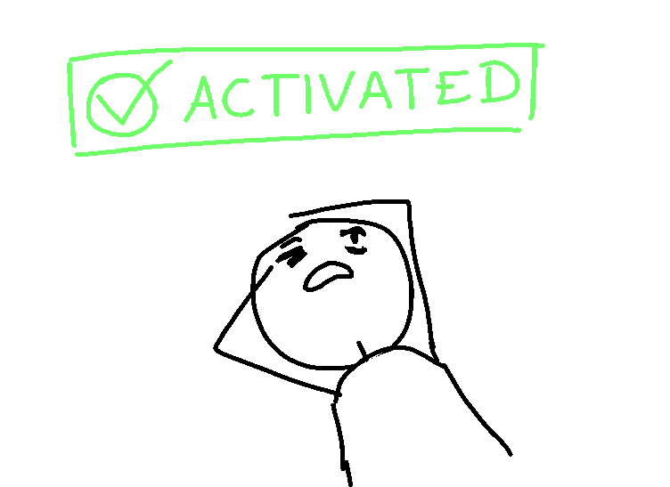
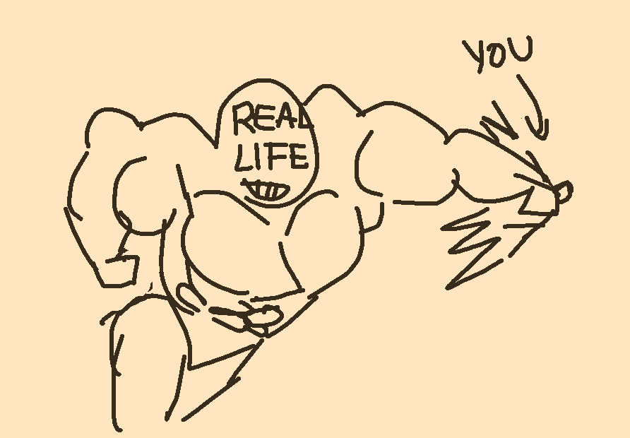

"I... activate... myself." you announce as you wake up, still a bit dazed
and groggy from your lengthy nap, summoning a bright green sign above you.
Your head really hurt for some reason, but mostly just the right side.

You lift yourself up and look around, trying to find someone to apologize
to. You didn't mean to be away for so long! It just happened!

Eventually, you find someone passing by - "Oh, h-hello." this
awkward-looking someone with large glasses mutters at you. What was their
name...? Man, it's been a while. Uh, the one with that ice had thingy - oh!
SARAH, right? "Welcome back." she says, and waves.

"Hey, SARAH, sorry about what happened." you tell her. "I just... dozed
off."

"D-don't worry about it!" she sheepishly chuckles. "REAL LIFE happens
sometimes, d-don't worry about it."

"REAL LIFE?" you wonder.

"Yeah, s-sometimes it hits r-really hard. B-but it's OK! P-please don't
worry about it."

Huh... was that what happened? It's hard to remember, but you can somewhat
piece in your mind... something...

Oh yeah, *now* you remember, as you rubbed your head where it hurt the
most. They sure hit you good.

"D-do you feel better?" SARAH asks you.

"I think so, yeah." you reply, feeling your pain gradually fade. "So, what
happened while I was away?"

"Well... q-quite a bit! Some p-players have won, a few s-scams here and
there." she replies, looking away and scratching her cheek. "But t-things
are... m-mostly the same! I-it normally takes some m-more time before we...
c-change anything." she adds, and chuckles nervously.

- Go to the CONTRACTS district
- Ask her about her COLD HAND OF JUSTICE
- Check out if you can contribute to society and get a job or something by
  becoming an OFFICER.
- Write in

[D. Wet chooses "Check out if you can contribute to society and get a job or something by
becoming an OFFICER."](update13.html)

---

So, for those who might not know what Agora Quest is, you all control the
same protagonist, and you can pay me coins to continue the story with
whatever input/choice/actions you'd like to do. You can do one of the
suggestions, or anything else you'd like!

The coin system has changed quite a bit since I last ran this! So, 5
boatloads of coins per input please!
