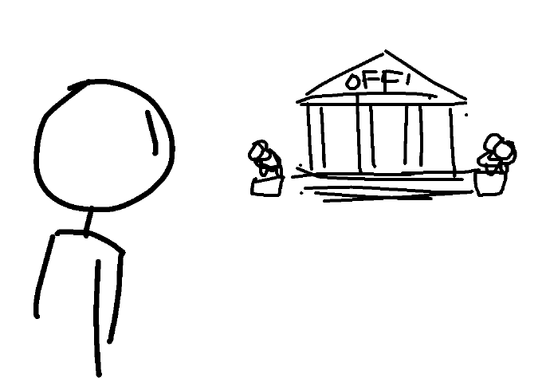
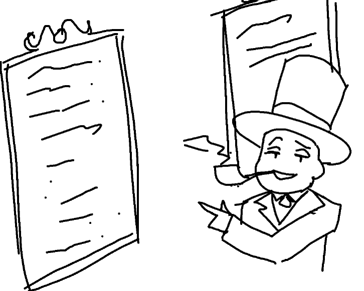
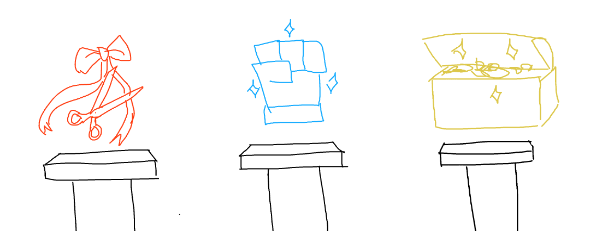

You decide to get a job! That OFF: place seemed promising (it started with
OFF-, like OFFICERS!), and if your previous skimming of the ruleset was
right, then there should be reports about officers... somewhere. Might as
well start here.

You enter the building, finding TOP HAT MAN inside.

"Welcome back!" he tells you in a chipper tone, holding his pipe. "Looking
for something?"

"Yeah, some OFFICER work." you tell him. "I've read that it pays?"

"Sure does." he replies, and gestures to one of the framed pieces of paper
on the wall. The frames themselves seemed ornate and well taken care of,
but you could notice the faded tone and quality of them being quite aged.
However, the papers within seemed very new in comparison, many had the
bleach-white sheen of being freshly printed.

"We're always open to newbies taking up new positions." he affirms.

"I'd have to take part in some... ELECTIONS, right? To earn the spot?" you
ask.

"Well, yes... but they're not a big deal." he chuckles. "They're most of
the time just a formality. There's rarely any actual competition."

"...Oh."

There's currently available:

* \[TAILOR\]: COMPLEXITY: 1 (low burden, low pay), you can give GRAY RIBBONS
  once per REPORT.
* \[REFEREE\]: COMPLEXITY: 2 (medium burden, medium pay), you can dispense the
  COLD HAND OF JUSTICE.
* \[TREASUROR\]: COMPLEXITY: 3 (high burden, highest pay). Controls various
  AUCTIONS.

- Choose to become the TAILOR
- Choose to become the REFEREE
- Choose to become the TREASUROR
- Hey, screw being an OFFICER, I'm going to make a
  choose-your-adventure-like game for the Agorans to play for money and busk
  some dosh that way.
- Write-in

[Trigon chooses "Choose to become the TAILOR"](update14.html)
