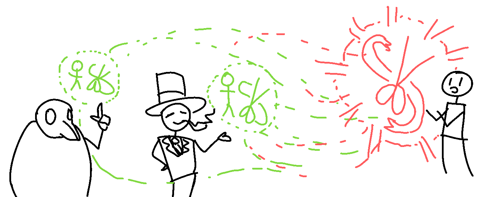
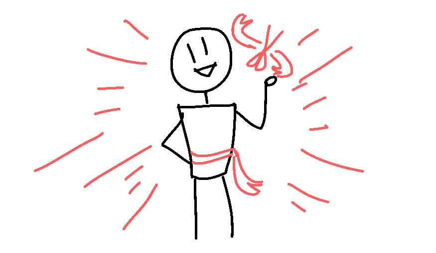
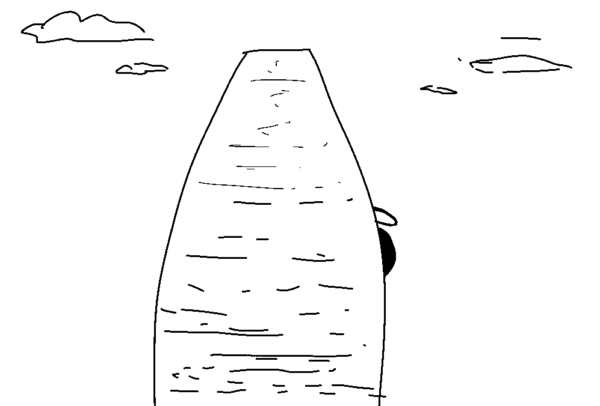
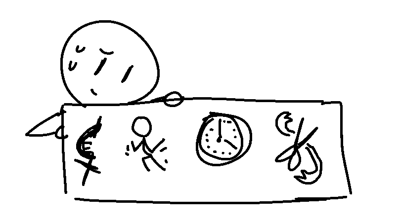

"Hey, could I become TAILOR?" you ask.

"Sure thing." TOP HAT MAN tells you. " I suppose you could also DEPUTIZE
for it, but a short ELECTION will do the trick just fine."

A while after, an ELECTION is set up, and a few Agorans vote for YOU to
become TAILOR - their votes gathering some kind of energy which then, once
they were all made, gathered and floated towards you, infusing you with new
OFFICER POWERS and OFFICER RESPONSIBILITIES.

Badaboom, you're the TAILOR now!

(You can choose to go around with your TAILOR apparel visible, although you
can change this and adjust your appearance at any time by changing your
SIGNATURE.)

"Don't disappoint now. Keeping an accurate record is important." PLAGUEMASK
tells you, before retreating back to the underground after the small event
is over. "I'm sure he'll do fine." TOP HAT MAN chuckles.

You can feel the weight of RESPONSIBILITY of the role on your body like
some kind of gravity, a pull that seems to try to obstruct and slowen you
somewhat. But you also feel invigorated with new POWERS, and by sheer will,
you can now conjure GRAY RIBBONS.

But wait, as the Agorans return to their normal lives, you notice a shadow
behind the giant RULESET obelisk, looming. Creeping slowly. Something was
going on, and it seems like nobody else has noticed yet.

A recap of your current assets:

You have a KILLBLADE - it's a SCAM, and it looks small and very fragile.
You don't know much more about it given your low understanding of the art
of SCAMS, aside from that it seems very dangerous.

You can DANCE A POWERFUL DANCE, pretty well too, in fact!

You know how to FILIBUSTER. A dangerous but powerful, dark art!
Questionable, but it can DELAY your target!

You are the TAILOR, which reduces your mobility slightly, but will give you
income over time as you hand in REPORTS, and you can give GRAY RIBBONS.

What do you do?
- Point it out and holler for help.
- Carefully sneak in closer and investigate what's going on.
- Stab it with your KILLBLADE!
- (Write in)

[Aspen chooses "Carefully sneak in closer and investigate what's going on."](update15.html)
