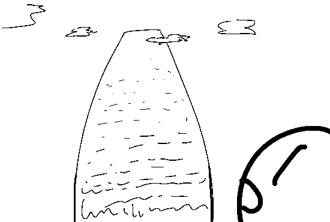
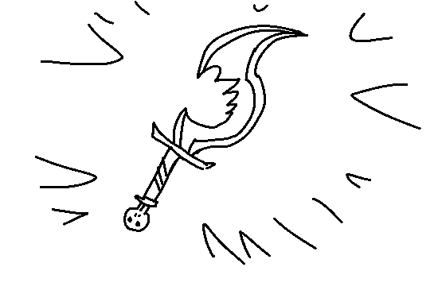
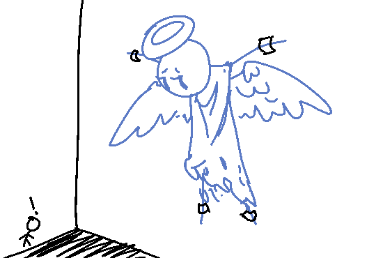

You decide to go to the RULESET to look for a SWEET SCAM. You find the
RULESET to be a massive, sky-scraping monolith in the middle of Agora, with
inscriptions etched into its ancient stone. Carefully, you look in between
the nooks and grooves of these inscriptions, and you find...

The KILLBLADE! It's made out of black, semi-translucent glass.This SCAM is
a powerful weapon, but it seems fragile, almost like if it's SINGLE-USE.
It's also not shaped like a conventional weapon either, alluding to that
its DIFFICULT TO USE.

Huh? What's this? During your searching, you manage to find a huge, godly
entity, strapped by... what seem to be manacles made out of this same black
glass as your blade, to the back of the RULESET, in the shadows. It looks
at you, but it doesn't say anything.

- Warn the other Agorans about this.
- Try to search for more useful things in the RULESET
- Visit the nearby fountain
- (Write-in)

[Jason chooses "Ask the entity what Rule it is defined by."](update3.md)
