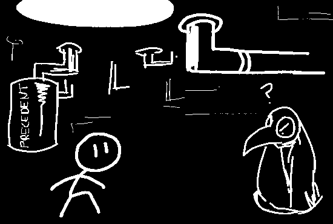
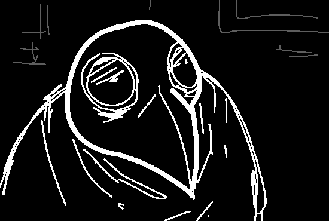

You decide to go over to that pit you found before, labelled as "CFJ
Archives". Carefully, you let yourself drop into its humid, dark chamber...

*THUD* You land on the moist, metallic floor, ending an echo throughout the
network of ancient tubing and plumbing that spans underneath... well, it's
hard to see. But you don't see the end to it.

"Hrm? Hello?" a croaky voice asks you, from an individual called
PLAGUEMASK. "Who are you?" he continues.

"I'm just new here." you reply.

"Ah, hm. I see." he replies, then scratches his chin. "Any PRECEDENT in
particular that you're interested in, then?" he inquires. "Or just
visiting?"

"PRECEDENT?" you ask.

"That's what this place mostly stores. PRECEDENTS." he explains, then
points to the tubing in the shadows. "It's what fundamentally runs Agora.
They're quite essential, didn't you know?"

"I thought the RULESET was what was most important. Well, *fundamental*"
you reply.

"Hogwash! Aaaah don't let those people that hang out on the surface confuse
you." he adds, then leans in closer. "Deep down here, in the wisdom of the
ages, in the lessons and mechanisms placed by our forefathers and
ancestors, is where lies the true gears and cogs of reality. PRECEDENTS are
the... basis, for everything else, I dare say!"

"So, uhm. My player CFJ is here too, right?" you wonder, remembering that
it was a CFJ as well.

"Yes. Of course. I've got to file that down here sometime soon, hoho." he
replies, then chuckles. "See? Thus is the power of CFJs. Only through that
have we known that you are indeed a player!"

The individual then nods. "Welcome, to Agora."

- Ask him if he knows anything about the stuff hidden behind the RULESET
monolith
- Ask him about the other Agorans you know (TOP HAT MAN and LADY CAT(...)),
what do the ancient CFJ records say about them?
- Request to learn more about the ancient teachings of CFJs
- (Write in)

[Falsifian chooses "Ask him about the other Agorans you know (TOP HAT MAN and LADY CAT(...)), what do the ancient CFJ records say about them?"](update7.html)
