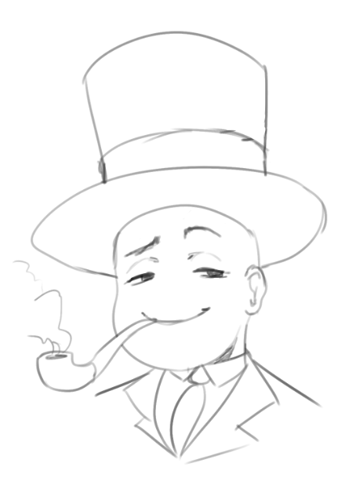
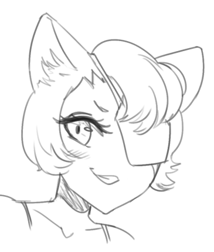

"May I check around the archives, PLAGUEMASK?" you ask them. "First time
I'm here."

"Sure, all yours." he replies. "Let me know if you need anything, alright?"

"Actually, I wanted to check up TOP HAT MAN, and LADY CAT-... something
something."

"Ah, those! Hold on now, I should have a few around here..." they reply,
and they waddle off, into the darkness. They soon return with armfuls of
more tubes - which you notice to be that they're made of rolled-up
parchments.

"Let's see here. Ah. TOP HAT MAN... What would you like to know?"
PLAGUEMASK then asks you.

"Well. I'm just curious, honestly, about what the CFJ archives hold." you
reply.

"Ah, ah. Good start, good start." the other replies, pointing to you.
"Well, let's see here. TOP HAT MAN is quite the veteran. His first CFJ was
of him being a player, like usual... several decades ago. Aha, I remember
it. I used to hang out at the surface during those days. Horrible times.
The sunlight, the chatter, ugh. Here it's quiet. Peaceful - the best of
Agora. Distilled."

"What's that over there?" you ask, pointing to a name in one of the
parchments that he was holding. "BLOGNOMIC?" you ask.

"Ugh! Blognomic!" PLAGUEMASK barks back. "Those filthy heathens. They're
faraway grounds, wastelands off to the east - another nomic, like us. But
they... " the masked one shudders, then his head twists side to side like
if he had eaten a lemon " ...they don't have a CFJ archive! Nothing like
it! Such a horrendous lot. Unorderly. Chaotic. It's a brawl of nonsense and
contradiction every day over there. Horrible, horrible."

PLAGUEMASK then straightens his cloak. "TOP HAT MAN... was originally a
player, from there. One of its first players, in fact. But he immigrated
here, and has pretty much permanently settled in Agora now. Yes. A key
player, in fact, as our ARBITOR. Been one for very long now. He's skilled -
because, haha: more knows the devil for being old than for being the devil."

"The devil?" you wonder.

"You also asked about LADY CAT, yes?" PLAGUEMASK then mentioned

"Yeah." you reply.

"Her? Haha." He starts off.

"She's an imbecile. She should learn from you and hang out more down here -
trying to pull crazy scams all day, but they're for naught because she
doesn't pay enough attention to the actual, *real* Agora. But in time, she
will realize. Eventually. Until then, she's going to be filling my precious
archives with pointless... waste. DISMISS, DISMISS. And if it's not that,
it's funny business that isn't particularly... relevant, to anything, aside
from being a bother."

"But her CFJs are CFJs nonetheless, and it is my duty to store them." they
add, then sigh.

- Ask if he could share with you any ancient-CFJ-pulling scams or defenses
that you could use if you need to for when you're back on the surface.
- Warn him about the avatar of Agora struck behind the Ruleset.
- Explore the rest of Agora further.
- (Write-in)
