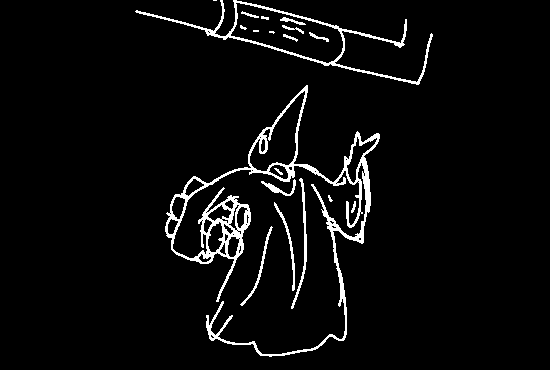
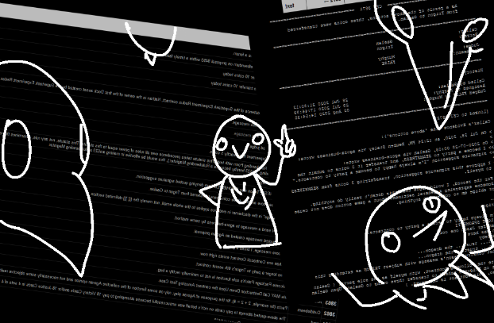
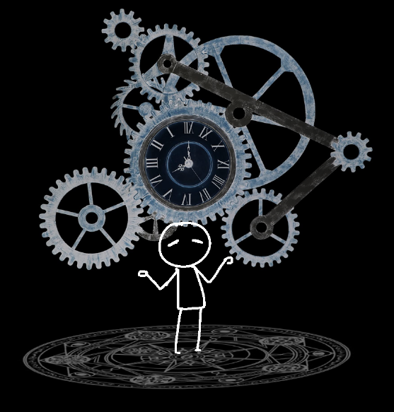

"Hm. Alright." you then tell him. "So, I don't want to fall into the same mistakes as Cat. Hm - are there like, primorial secrets here? Something that I could learn."

"Hm. Everything, in fact! Yes." he replies, browsing through the network of scroll-tubings. “Everything.”

You raise an eyebrow.

“You do not know, what you do not know, yes? Imagine I bring up a situation regarding… who is a Player, and not, and you need to know that CFJ 230 is related to it, because it describes metaphysical properties related to how a person’s qualia is itself a substance in juxtaposition to….”

He carries on with technicalities that escape your comprehension.

“If you didn’t know that CFJ 230 existed in the first place, and its contents, how would you know the actual TRUTH behind what is going on when that situation occurs? You don’t know what you don’t know! Therefore, you should diligently study not part of the archives, but *all* of it. It’s *all* important.”

“But there’s so much down here!” you counter.

“Aah, but it will be worth it!” he tells you. “The archives aren’t going anywhere. It will always be here. No rush.”

You sigh.

“Fine. So, where do I start?” you wonder.

“I’m glad you asked! So, you see…”

You endured hours of listening to PLAGUEMASK’S mind-numbing lecture about obscure edge cases and other CFJ results, but not really retaining much, as he’d get far too deep into technical cases that he was passionate about rather than explain the build-up to them. He wasn’t empathizing with that you were new, and was just rambling about what he enjoyed about the archives and history. Battles between Agorans and other nomics seemed to be his preferred subject, as well as scams and how they were pulled, or defeated, the spilling of blood and honor, and so on.

But you weren’t really too interested in that - what about the rest? You know, solutions to things which doesn’t involve bombing Agora with a scam nuke, or fighting against an Agora-wide mousetrap.

And as your mind wandered off, away from PLAGUEMASK’s rambling, you noticed something. The faint dripping of some of the piping here was… slower? Ever so slightly.

“Hey! Are you paying attention?” he then barked.

The dripping went faster again. How?

“Yeah, uh, sorry about that. What did you say about the second Agoran war?”

“Yes, of course, you see, there was an impressive-” he carried on.

The dripping became almost imperceptibly slower again. But you noticed it. There was a correlation? You decided to try something. There was a correlation between… spouting a bunch of reasonable nonsense, and *time*.

What if you could… try the same, but… Maybe more… it was worth a shot - it was at least something to put your mind off PLAGUEMASK’s lecture.

Slowly, you focused on what you felt to be nonsense and bullshit, pulling it from the obscure CFJs around you that were giving you such a miserable time with PLAGUEMASK here, and you concentrated on it. You channelled it.

And so, a glowing circle of power appeared under your feet, and you could feel som-

“HEY HEY HEY, DON’T PULL A FILLIBUSTER IN HERE!” PLAGUEMASK warned, and then showed a palm at you, and then snapped his fist shut, causing the circle to disappear with a shattering sound.

“H-how did you… learn to do that, anyways?” he insists. “That’s DARK ARTS. A Class-4 crime.”

“Wait, what? What did I do?” you ask.

“You don’t know?” he replies. “You were performing a FILLIBUSTER. An arcane art that SLOWS TIME. It’s a DARK ART though, because you need to hold a DARKENED HEART to pull it off - because conjuring arguments just for the sake of it and clogging the weave of reality. I’m not going to POINT MY FINGER at you, but really, what were you trying to do there?”

“Wow, really?” you say back. “I, uh. I really don’t know what I was doing. I just figured I could try it out.”

“It’s… remarkable that you’d discover how to do it, just on your own.” he replies. “But aren’t you supposed to be listening! We can get into the arcane later! You need to learn your basics first! Now, listen, listen.”

You wanted to roll your eyes. PLAGUEMASK wasn’t a good teacher, and seems like they just want someone to talk to - rather, to have listen to them, about CFJs and history and such.

SPELL LEARNT: FILLIBUSTER. DARK ART. Level 1. Slows down time moderately in a chosen area near you. You can currently only source its power from the CFJ Archives - you need to be near the ground (or under it, in the archives) to perform this spell.  

- Make an excuse to get yourself out and return to the surface, and check out the rest of Agora

- Apologise and wait out his lesson, even if you aren’t really understanding much at all of it.

- (Write-in)

[ATMunn chooses "Make an excuse to get yourself out and return to the surface, and check out the rest of Agora"](update9.md)
