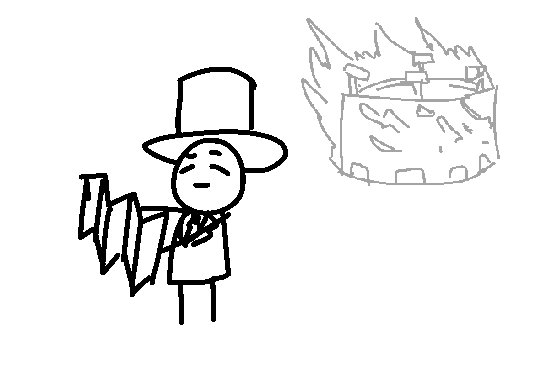
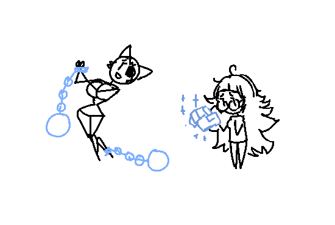

"Uhm, PLAGUEMASK" you tell the man.

"Yes?" he replies.

"I forgot something really important on the surface - I've got to go back up and out. Could we meet up some other time?"

"I don't see why not. But, what's the matter?" he says back.

"Alright, thanks, see you sometime, then!" you input, and quickly get yourself out of the pit, and climb back up to the surface.

The light of the outside blinds you for a moment, but your sight soon settles into the warm, familiar brightness of the regular world. Curious, you look around Agora, finding a nice FOUNTAIN with an inscription in it about it being placed there by certain individuals, and you continue looking around, eventually finding behind the OFF: building a few other Agorans near a burning stadium.

TOP HAT MAN was near it, looking at a PROTO PROPOSAL, then sketched in a couple more lines into the blueprint, and scratched his chin calmly.

"Heya, TOP HAT MAN. What's going on?" you ask him, and gesture to the catastrophe.

"Oh, that? Well, we were trying to make a cool way to win the game, but it's buggier than we expected. So I'm trying to look for a way to fix it."

And nearby, you find LADY CATASTROVANIA (... ) with another, meek-looking Agoran, who had a COLD HAND on the end of one of their wrists.

"These are enough blots, don't you think?" the tall vixen cooed.

"I-I, uh." the other replied, looking to a side sheepishly - they were SARAH SMITH.  "I don't k-know, what you did was p-pretty, uh. Serious."

"But I didn't really dooo anything, did I? Anyone can miss a REPORT, right? Please consider that."

"T-the blots aren't only a-about that! I-its a-about deliberately missing them t-to your advantage... to o-obscure the game, t-t-t-t-to your advantage." the other young woman stammered. "t-that seems more... s-serious."

"But that even happens to the best of us, doesn't it?" CAT insisted. "How about this, a compromise: you add the blots, but you make them forgivable. That seems the fairest, right, miss REFEREE?"

"I-I d-don't know... uhm, maybe, I-I..."

"Then it's settled! Forgivable blots!"

"..."

- Volunteer to help TOP HAT MAN with their PROTO
- Report to the REFEREE the Agoran avatar that is stuck behind the RULESET
- Endorse LADY CAT and suggest that her punishment should be less severe.
- (Write-in)

[Trigon chooses "Ask TOP HAT MAN about the details of the scam that just occurred."](update10.html)
